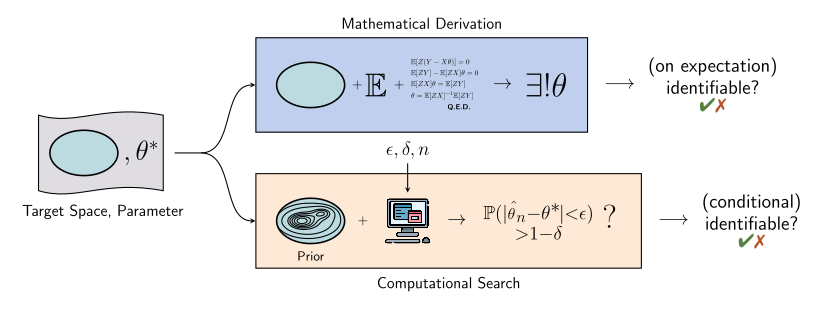
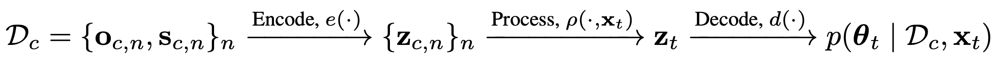
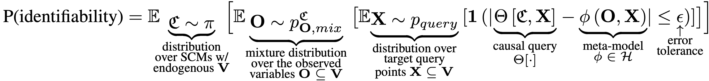
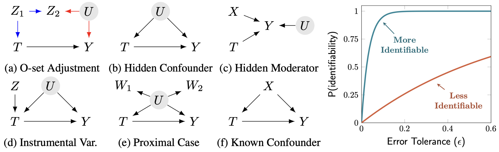
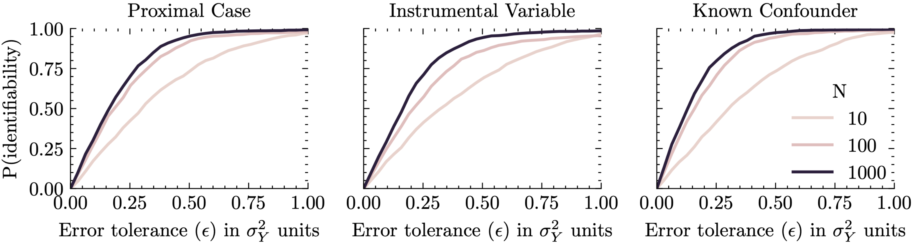
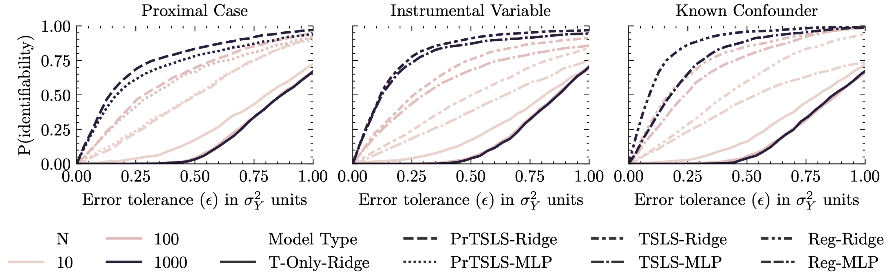

# Meta-/in-context/amortized causal inference for `computational identifiability`

[](https://badge.fury.io/py/metadentify)
[](https://arxiv.org/abs/2606.19361)
[](https://lightning.ai/docs/pytorch/stable/)
[](https://www.python.org/downloads/)
[](https://github.com/lbynum/metadentify/actions)
[](https://github.com/astral-sh/ruff)
[](LICENSE)

<figure align="center">
  
</figure>
<!-- <figure align="center">
  
</figure> -->

> Two approaches to identifiability. Mathematical derivation (top) seeks to prove the existence of a unique parameter, analytically in expectation. Computational search (bottom, implemented in this repository) instead defines an empirical search procedure for an estimator and defines 'computational identifiability' as the successful discovery of an estimator, conditional on a prior over parameters, a hypothesis space over estimators, finite samples, and a desired error tolerance.

</br>

This repository contains the official code and resources for the paper [**Computational Identifiability**](https://arxiv.org/abs/2606.19361) (https://arxiv.org/abs/2606.19361).

## Overview

A critical step in answering a causal or statistical query from data is determining if there is sufficient information to compute a unique answer. Traditionally, **theoretical identifiability** achieves this mathematically in expectation, often relying on mathematically idealized conditions like asymptotic properties or infinite data.

However, in many practical scenarios—such as those with finite sample sizes, ambiguous graphical criteria, or complex combinations of observational and experimental data—theoretical guarantees may offer little guidance on whether a target parameter can actually be estimated.

This motivates **computational identifiability**, a complemetary notion of identifiability that is computation-bound. Instead of analytical mathematical derivation, it frames identifiability as a finite computational search procedure for an empirical estimator.

## What is Computational Identifiability?

Computational identifiability starts with:
1. A meta-prior over the parameters in question (e.g., a distribution over structural causal models, or SCMs).
2. A hypothesis space of possible estimators (e.g., an instantiated Conditional Neural Process, a pre-trained tabular foundation model, etc.).

For a given finite sample size, error tolerance, and confidence bound, computational identifiability is satisfied if an empirical estimator exists within the hypothesis space that can successfully estimate the query within the desired error margin. 

## Framework & methodology

To operationalize this search, we further generalize the connection between meta-inference and causal effect estimation.

<figure align="center">
  
</figure>
<!-- <figure align="center">
  
</figure> -->

> To meta-learn causal estimators, we define context set $D_c$ of $n$ observations $O=o$ and source labels $S=s$. Source labels can be, e.g., indicators for 'observational,' 'interventional,' 'counterfactual,' etc., corresponding to each type of data available for meta-training. We then define the target set $D_t$ consisting of $m$ query points $X_t=x_t$ and corresponding realized causal query values $\Theta_t = \theta_t$. The meta-model processes these inputs in the style of a conditional neural process (CNP) as pictured in the diagram above (see Section 3.1.1 in the paper for full architecture descriptions).

<figure align="center">
  
</figure>
<!-- <figure align="center">
  
</figure> -->

> The 'probability of identifiability' — how likely will the causal query be approximated within an $\epsilon$ margin of error by a meta-model $\phi$ in our chosen hypothesis space $\mathcal{H}$? 


<figure align="center">
  
</figure>
<!-- <figure align="center">
  
</figure> -->

> **(a)-(f)** A few example DAGs we consider in the paper. **(Right)** Diagram showing *computational identifiability curves*, visualizing computational identifiability across a range of possible $\epsilon$ values. The empirical (or posterior) probability of identifiability can be read at a given desired error tolerance (see Section 3.2 in the paper for the corresponding algorithm).


* **Meta-learning causal effect estimators:** We learn mappings from observations and query points to causal query values by training on joint distributions over SCMs, observations, and query values. The `experiments/` folder demonstrates applying this same meta-learning process to several settings.


* **Architectures:** Many architectures are possible. This repository implements two Conditional Neural Process (CNP) style architectures with conformalized quantile regression to use out-of-the-box (see `modules.py`). The Q-CNP uses mean-pooling and Q-TNP uses attention-based processing.

* **Posterior estimates:** By using models that support posterior uncertainty, we can directly estimate the 'probability of identifiability' for any new data at test-time. 

## Codebase & features

This package is designed for modularity, scalable training, and easy experimentation. 

### Causal mixtures & `dowhy` integration
* **`mixture.py`**: This module directly implements the joint-causal-query-mixture distribution used to generate meta-training data (see Definitions 1-6 in the paper for details).
* **`dowhy` backend**: The codebase natively supports the `dowhy` package (specifically `dowhy.gcm`) as its language for specifying structural causal models. This provides an intuitive and standardized way to experiment with new causal graphs and mechanisms. The main benefit is easy experimentation with **observational, interventional, and counterfactual** data and estimands.

### Infrastructure & scaling
The repository is optimized to easily scale up meta-learning experiments with distributed computing environments:
* **Weights & Biases (W&B):** Fully integrated for experiment tracking and metric logging built into the meta-model (`modules.py`).
* **SLURM cluster support:** Built-in utilities (`sbatch.py`) to easily format and launch parallel SLURM jobs for distributed training or sweeping.
* **Singularity environments:** Natively supports running your training scripts and sweeps inside Singularity containers for reproducible and isolated execution (`launch_sweep.py`).

> [!NOTE]
> Additional features and documentation under development. Stay tuned :)

* * *

## Usage examples

Below are usage examples for computational identifiability experiments. The same `run-experiment` function can be called and routed to different experiment files (e.g., `experiments/example_experiment.py`). The `--log_identifiability` flag can be added to any experiment to log the identifiability curve to W&B for normalized epsilon from 0-2.5. In addition, many other arguments are possible (see `args.py` for a full list of arguments). All runs and sweeps will automatically log to Weights&Biases unless `--disable_wandb` is passed.

<figure align="center">
  
</figure>
<!-- <figure align="center">
  
</figure> -->

> Identifiability curves from meta-models (the Q-CNP backbone in modules.py) trained on each of the cases in example_experiment.py, as a function of varying dataset size $N$.

</br>

<figure align="center">
  
</figure>
<!-- <figure align="center">
  
</figure> -->

> Identifiability curves from per-dataset estimation methods (implemented in baselines.py) instead of meta-trained models, for each of the cases in example_experiment.py.


The above figures plot P(identifiability) values from the W&B sweep defined in `example_sweep.yaml`, which automates running `example_experiment.py` across a range of parameters (see below for W&B setup instructions).

### Local runs

```bash
# run a single experiment locally with W&B logging
uv run run-experiment --experiment_setup_path experiments/example_experiment.py --experiment_name proxy --num_train_tasks 1000 --num_val_tasks 100 --num_test_tasks 100 --max_epochs 100
```


### Running with SLURM + Singularity + W&B Sweeps

Create a `.env` file with the following variables for wandb, slurm, and singularity environment settings.
```
WANDB_API_KEY=your_api_key
WANDB_ENTITY=org_name
WANDB_PROJECT=project_name

SLURM_USER_EMAIL=email@email.com
SLURM_ACCOUNT_NAME=slurm_account_name

SINGULARITY_ENV_PATH=/singularity/path
SINGULARITY_CONTAINER_PATH=singularity/container/path
```

#### Local W&B sweeps

In this example, we run a W&B sweep locally, with parameters defined in `experiments/example_sweep.yaml`.

```bash
# create sweep using config yaml
uv run wandb sweep experiments/example_sweep.yaml
> wandb: Creating sweep from: experiments/example_sweep.yaml
> wandb: Creating sweep with ID: abcd1234
> wandb: View sweep at: https://wandb.ai/wandb-entity/wandb-project/sweeps/abcd1234
> wandb: Run sweep agent with: wandb agent wandb-entity/metadentify/abcd1234
# start corresponding sweep agent
uv run wandb agent wandb-entity/metadentify/abcd1234
```

#### Distributed W&B sweeps on SLURM inside a Singularity container

In this example, we launch a 12-node distributed sweep experiment on SLURM inside a Singularity environment with W&B logging (using the same `experiments/example_sweep.yaml` config):

```bash
# first, create small virtual env for python-dotenv
python3 -m venv .venv-launcher
source .venv-launcher/bin/activate
pip install python-dotenv

# now launch the distributed sweep inside Singularity
python src/metadentify/launch_sweep.py --config experiments/example_sweep.yaml --num_jobs 12
```

### Paper examples

See `experiments/paper/PAPER.md` for usage examples from other experiments in the paper.

## Citation

If you find this code or concept useful in your research, please cite the corresponding papers:

```
@article{bynum2026computational,
  title={Computational Identifiability},
  author={Bynum, Lucius EJ and Ranganath, Rajesh and Cho, Kyunghyun},
  journal={arXiv preprint arXiv:2606.19361},
  year={2026}
}

@article{bynum2025black,
  title={Black Box Causal Inference: Effect Estimation via Meta Prediction},
  author={Bynum, Lucius EJ and Puli, Aahlad Manas and Herrero-Quevedo, Diego and Nguyen, Nhi and Fernandez-Granda, Carlos and Cho, Kyunghyun and Ranganath, Rajesh},
  journal={arXiv preprint arXiv:2503.05985},
  year={2025}
}
```

## Authors

[Lucius E.J. Bynum](https://luciusbynum.com), [Rajesh Ranganath](https://cims.nyu.edu/~rajeshr/), [Kyunghyun Cho](https://www.kyunghyuncho.me)

* * *

<p align="center">
Package made with <a href="https://github.com/jlevy/simple-modern-uv" target="_blank"> simple-modern-uv </a>
</p>